# FANTA007 V2 — Licence to Win

**FANTA007 V2** ti aiuta a costruire la rosa del Fantacalcio senza perdere di vista crediti, ruoli e valore dei giocatori.

Non devi creare un account e non servono competenze tecniche: imposti la tua lega, cerchi i giocatori che hai comprato e inserisci il prezzo pagato. L'app mette ordine nei numeri e ti mostra dove stai spendendo bene e dove conviene fare più attenzione.

### [Apri FANTA007 V2 online →](https://fanta007-licence-to-win.vercel.app/)

> Questa è la **V2 attualmente pubblicata**. I dati e i consigli sono un supporto alle decisioni: non sono previsioni e non garantiscono il risultato del Fantacalcio.

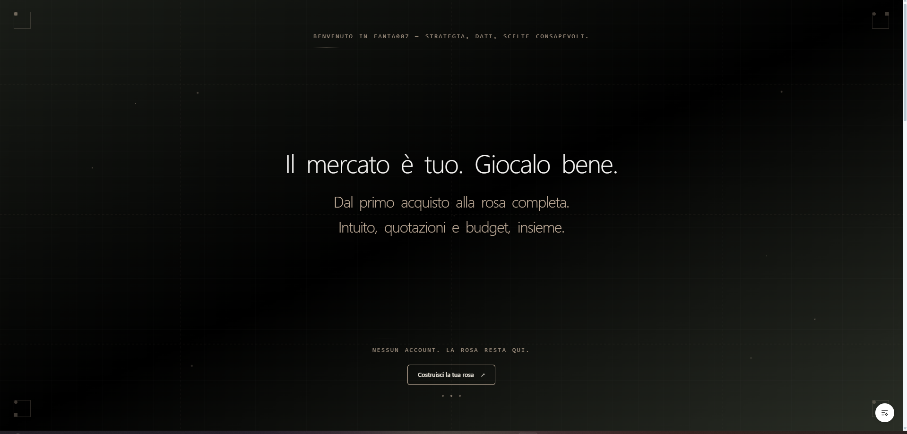

## Cosa puoi fare

- configurare nome, modalità, partecipanti, budget e obiettivo della lega;
- cercare e confrontare i giocatori nel Listone;
- aprire un dossier con quotazioni, statistiche e spiegazioni;
- registrare i tuoi acquisti e il prezzo realmente pagato;
- controllare crediti, posti liberi e distribuzione della spesa;
- ricevere un consiglio leggibile, accompagnato dai dati che lo motivano.

## Come si usa, in 4 passi

1. **Configura la lega.** Segui le cinque domande iniziali.
2. **Apri il Listone.** Cerca un giocatore per nome, squadra o ruolo.
3. **Registra l'acquisto.** Inserisci il prezzo pagato durante l'asta.
4. **Controlla la rosa.** Guarda budget, reparti e prossima decisione suggerita.

La rosa resta salvata nel browser che stai usando. Se cancelli i dati del browser o cambi dispositivo, non viene trasferita automaticamente.

## Un giro dentro la V2

### Configurazione guidata

Un passaggio alla volta: prima la squadra, poi partecipanti, regole, budget e obiettivo.

| Nome della squadra | Partecipanti | Configurazione completata |
| --- | --- | --- |
| 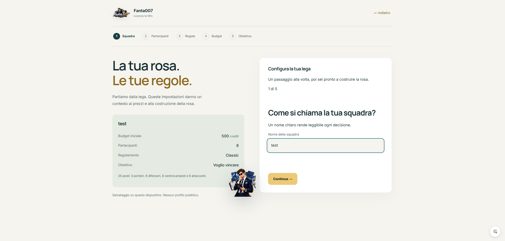 | 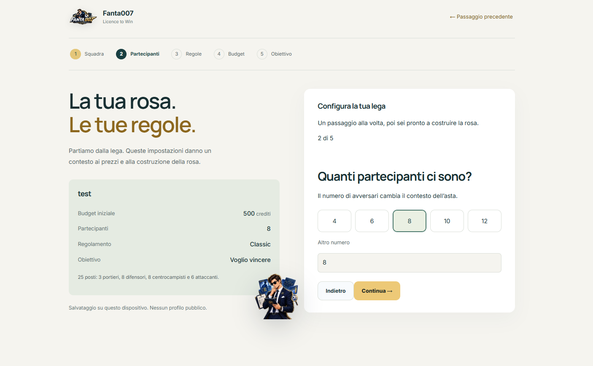 | 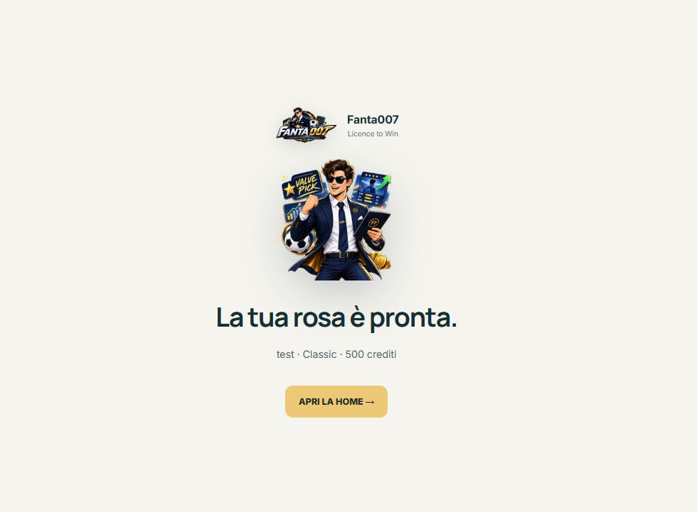 |

### Home e controllo del budget

La Home riassume la situazione dell'asta, indica quanti posti mancano e rende visibile la distribuzione dei crediti.

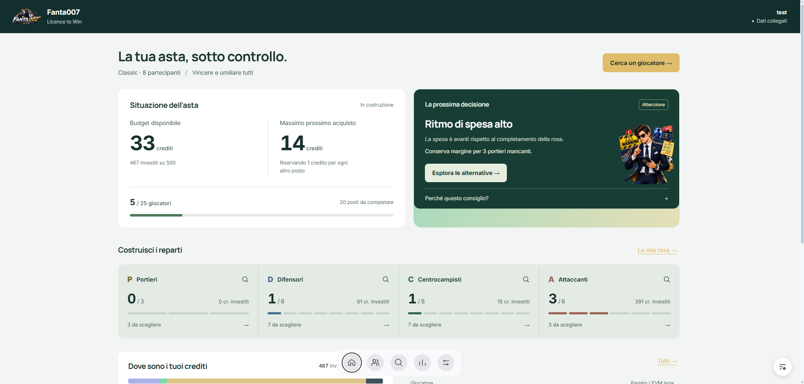

<details>
<summary>Guarda il dettaglio di crediti e ultimi acquisti</summary>

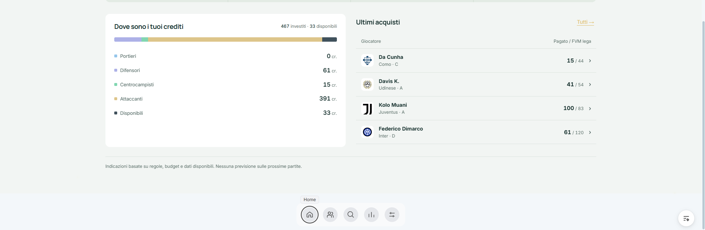

</details>

### Listone, rosa e analisi

Nel Listone puoi cercare, filtrare e ordinare i profili. Nella rosa ritrovi gli acquisti divisi per reparto; nell'analisi vedi budget, completezza e segnali principali.

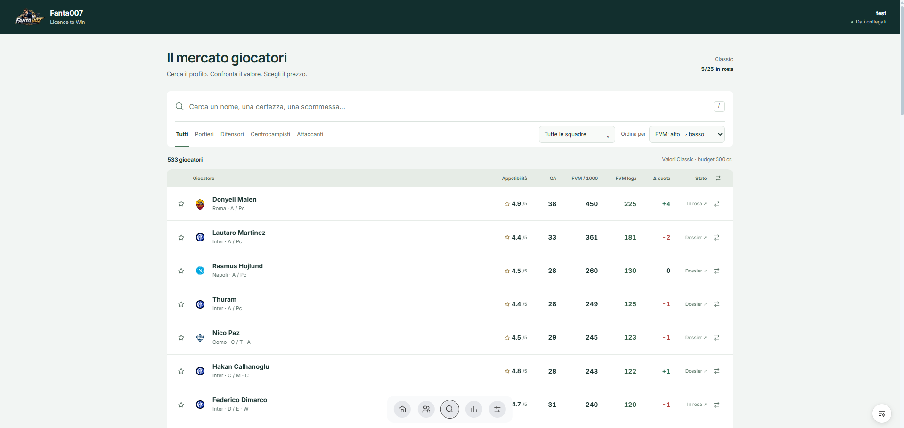

<details>
<summary>Guarda La mia rosa e Analisi della rosa</summary>

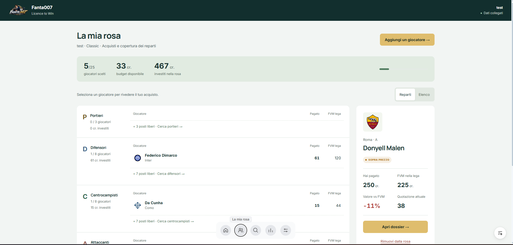

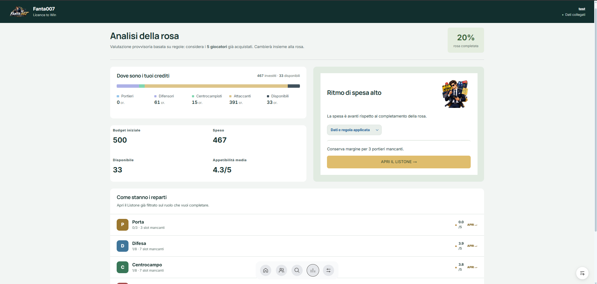

</details>

### Player Dossier

Ogni giocatore ha quattro viste: **Scheda**, **Statistiche**, **Analisi** e **Consiglio**. Le tab compatte si espandono quando le selezioni, così resta più spazio per i contenuti.

| Scheda | Statistiche |
| --- | --- |
| 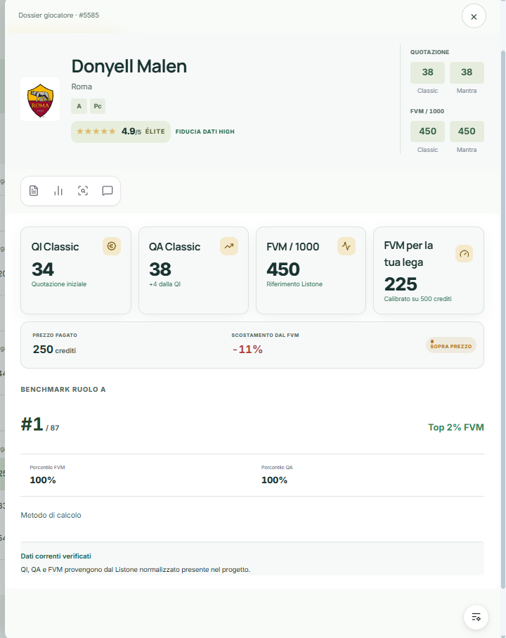 | 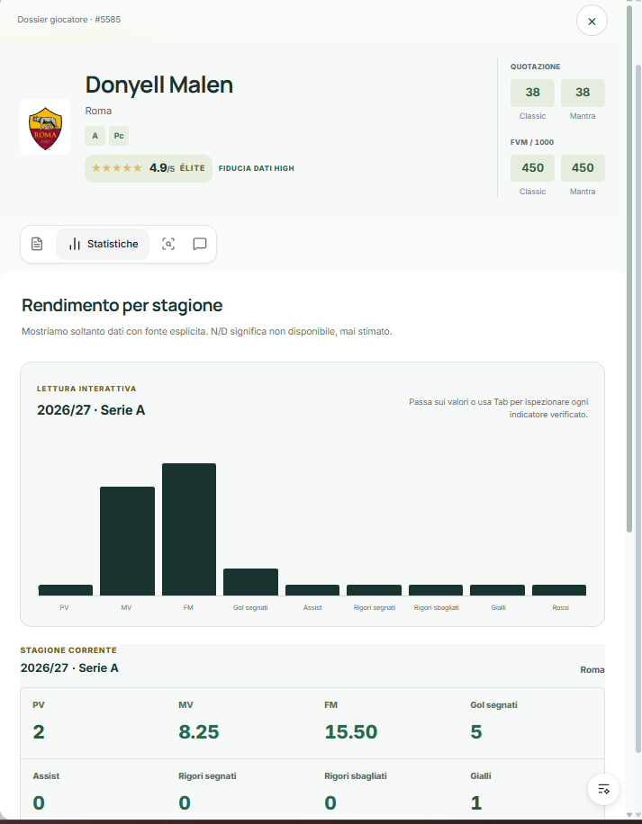 |

| Analisi | Consiglio |
| --- | --- |
| 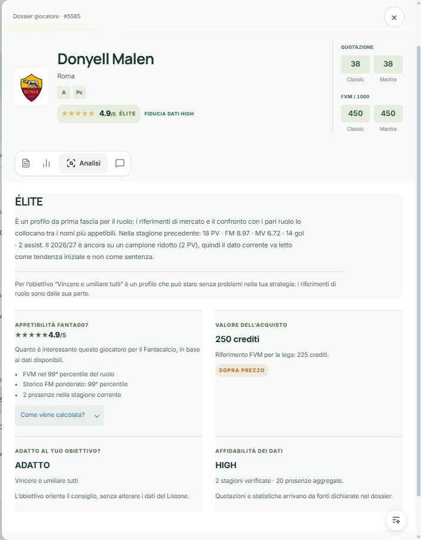 | 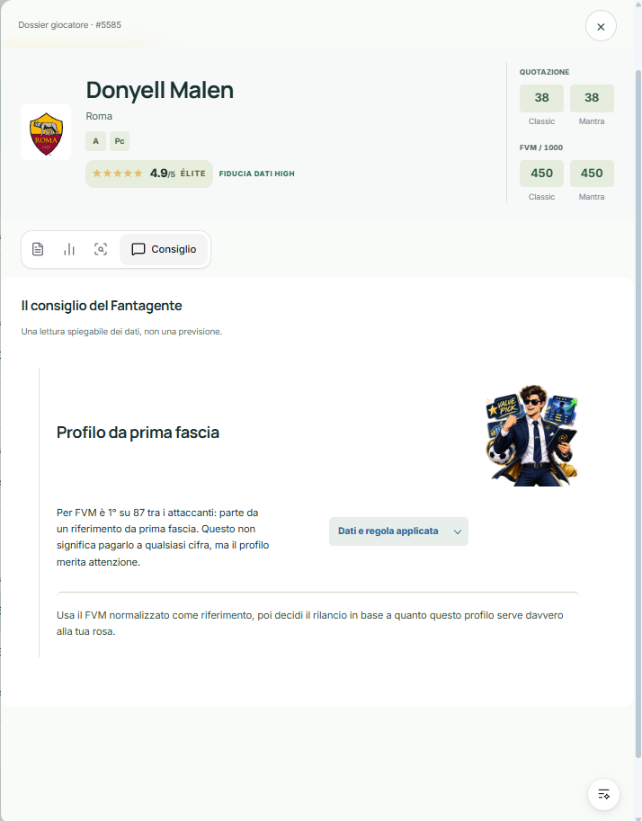 |

### Presentazione, funzioni e impostazioni

La V2 introduce una presentazione più riconoscibile, una panoramica delle funzioni e un pannello impostazioni più chiaro.

<details>
<summary>Guarda le altre schermate della V2</summary>

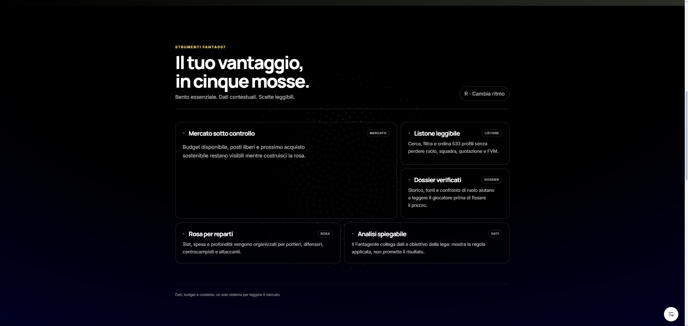

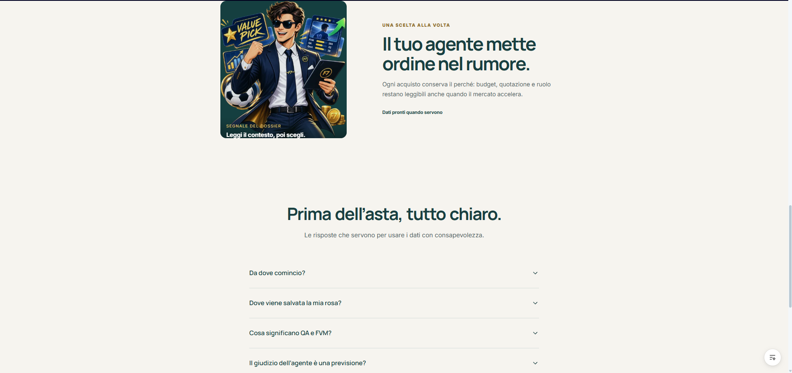

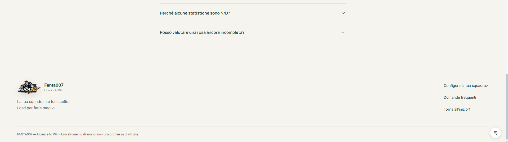

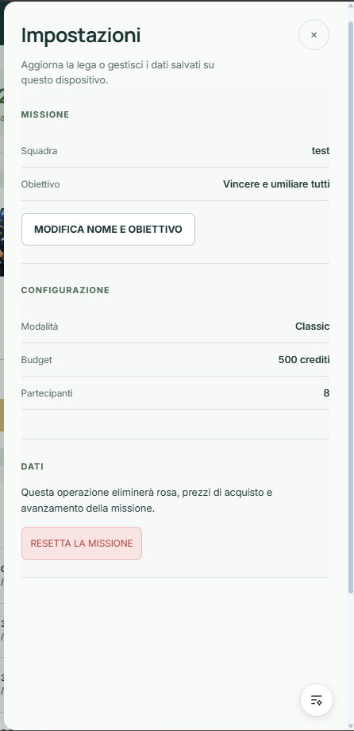

</details>

## Due parole che trovi spesso

- **QI**: quotazione iniziale del giocatore.
- **QA**: quotazione attuale.
- **FVM**: FantaValore di Mercato, usato come riferimento per l'asta.
- **FVM lega**: FVM adattato al budget della tua lega.
- **PV**: presenze a voto.
- **MV**: media voto.
- **FM**: fantamedia.
- **Appetibilità FANTA007**: indice che riassume quanto il profilo è interessante nei dati disponibili. Non è un prezzo e non è una promessa di rendimento.

---

# Dietro le quinte

Da qui in poi trovi le informazioni tecniche utili a sviluppatori, reviewer e a chi vuole capire come è costruito il progetto.

## Cosa cambia nella V2

La V2 mantiene le logiche applicative e rende più chiaro il percorso completo:

- onboarding guidato in cinque passaggi;
- nuova hero e presentazione del prodotto;
- navigazione flottante coerente tra le aree principali;
- Home orientata alla prossima decisione;
- Listone più leggibile e confrontabile;
- rosa organizzata per reparti;
- Player Dossier con quattro tab espandibili;
- analisi con regola applicata e spiegazione del consiglio;
- layout responsive per desktop e mobile;
- stati di focus e aree cliccabili più accessibili.

Le interazioni selezionate da 21st.dev sono state adattate al linguaggio visivo di FANTA007:

- [Hero Section — reuno-ui](https://21st.dev/@reuno-ui/components/hero-section)
- [Bento Features — larsen66](https://21st.dev/@larsen66/components/bento-features)
- [Floating Dock — manuarora700](https://21st.dev/@manuarora700/components/floating-dock)
- [Expandable Tabs — victorwelander](https://21st.dev/@victorwelander/components/expandable-tabs)
- [Stats Card — ravikatiyar162](https://21st.dev/@ravikatiyar162/components/stats-card-1)
- [Bar Chart — bklitai](https://21st.dev/@bklitai/components/bar-chart)

## Architettura

```text
Dataset normalizzato
        ↓
FastAPI REST API
        ↓
React + TypeScript + Vite
        ↓
Scoring e benchmark deterministici
        ↓
Listone, Dossier, Rosa e Analisi
```

### Frontend

- React 19 e TypeScript;
- Vite per sviluppo e build;
- Motion per le animazioni;
- componenti Radix, Lucide e Tabler per controlli e icone;
- stato della missione salvato nel browser con localStorage/sessionStorage.

### Backend

- Python 3.11+;
- FastAPI e Pydantic;
- API REST per giocatori, statistiche, squadre e risoluzione dei dati salvati;
- import, normalizzazione e controlli di integrità sul dataset.

### Perché il salvataggio viene “risolto” di nuovo

Nel browser vengono conservati gli identificativi dei giocatori e i dati inseriti dall'utente, come il prezzo d'acquisto. Quando l'app si riapre, il backend recupera le informazioni canoniche aggiornate. In questo modo la rosa non dipende da una vecchia copia completa del giocatore salvata nel browser.

## Dati e trasparenza

Il dataset attivo della stagione 2026/27 contiene:

- **533 giocatori**;
- **921 record stagionali** complessivi;
- 533 record Serie A 2026/27;
- 365 record Serie A 2025/26;
- 23 record EuroLeghe 2025/26 usati come fallback verificato.

Se un dato verificabile non è disponibile, l'interfaccia mostra **N/D** invece di inventare un valore. I controlli finali sono documentati in [`docs/stats_integrity_final.md`](docs/stats_integrity_final.md).

## Avvio locale semplice (Windows)

### Prima configurazione

Servono [Python 3.11+](https://www.python.org/downloads/) e [Node.js](https://nodejs.org/). Dalla cartella del progetto:

```powershell
python -m venv .venv
.\.venv\Scripts\python.exe -m pip install -e ".\backend[dev]"
npm install --prefix .\frontend
```

### Avvio quotidiano

Fai doppio clic su:

```text
START_FANTA007_FRESH.cmd
```

Lo script avvia e controlla backend e frontend, poi apre la preview. In alternativa:

```powershell
.\scripts\windows\Start-Preview.ps1 -OpenBrowser
```

- App locale: `http://127.0.0.1:5173`
- Presentazione V2: `http://127.0.0.1:5173/presentazione`
- Stato API: `http://127.0.0.1:8000/api/v1/health`

<details>
<summary>Avvio manuale di backend e frontend</summary>

Backend:

```powershell
.\.venv\Scripts\python.exe -m uvicorn app.main:app --app-dir .\backend --reload --port 8000
```

Frontend, in un secondo terminale:

```powershell
npm run dev --prefix .\frontend
```

</details>

## Test e build

```powershell
.\.venv\Scripts\python.exe -m pytest .\backend\tests -q -rs
npm test --prefix .\frontend
npm run build --prefix .\frontend
```

Ultima verifica della V2 pubblicata:

- frontend: **47 test superati**;
- backend: **134 test superati**, 4 test opzionali saltati perché richiedono gli export ufficiali locali;
- build di produzione: completata;
- verifica desktop e mobile: completata.

I test backend usano dati sintetici o file temporanei e non modificano i dati di produzione.

<details>
<summary>Media Review: accesso amministrativo locale</summary>

Le modifiche tramite `PATCH /api/v1/admin/media-review/{player_id}` sono disabilitate per impostazione predefinita e rispondono con `403 Forbidden`.

Per abilitarle in un ambiente locale fidato:

```powershell
$env:FANTA007_ENABLE_MEDIA_REVIEW_ADMIN = "true"
.\.venv\Scripts\python.exe -m uvicorn app.main:app --app-dir .\backend --host 127.0.0.1 --port 8000
```

Il flag **non autentica gli utenti**: quando è attivo, chiunque raggiunga l'API può modificare le revisioni. Deve quindi rimanere disabilitato nei deploy pubblici.

</details>

## Repository e demo

- [FANTA007 V2 online](https://fanta007-licence-to-win.vercel.app/)
- [Repository GitHub](https://github.com/AndreCalzone97/fanta007-licence-to-win)
- Percorso consigliato: **configurazione → Home → Listone → Dossier → La mia rosa → Analisi**

## Nota sul progetto

FANTA007 è un progetto indipendente realizzato a scopo didattico e portfolio. Nomi, marchi e dati di terze parti appartengono ai rispettivi titolari. Gli indicatori hanno finalità informative e non garantiscono risultati sportivi o di gioco.

---

**FANTA007 V2 — Licence to Win**<br>
_Meno rumore, più contesto per decidere._
