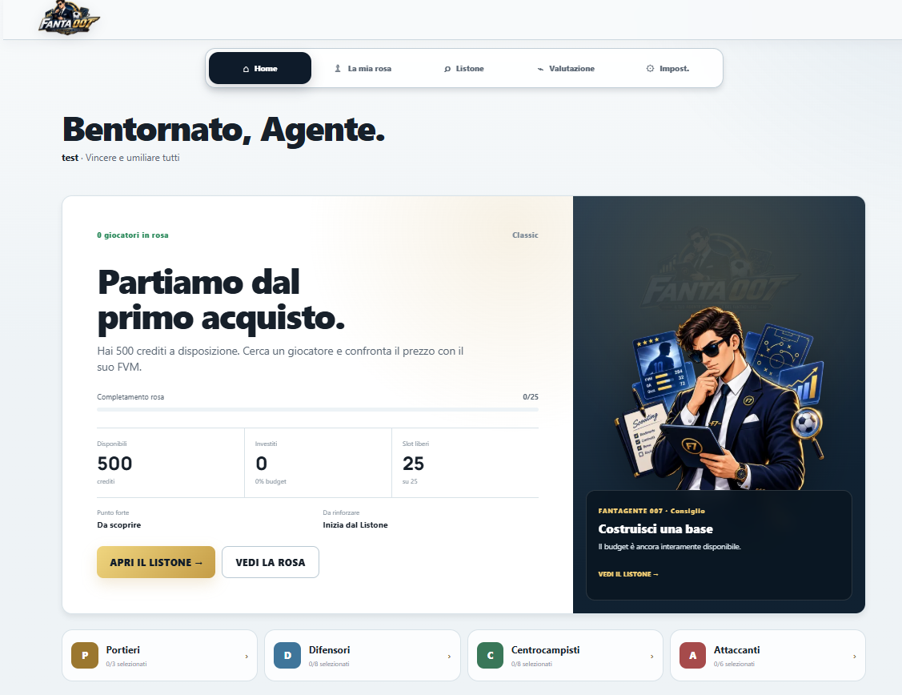
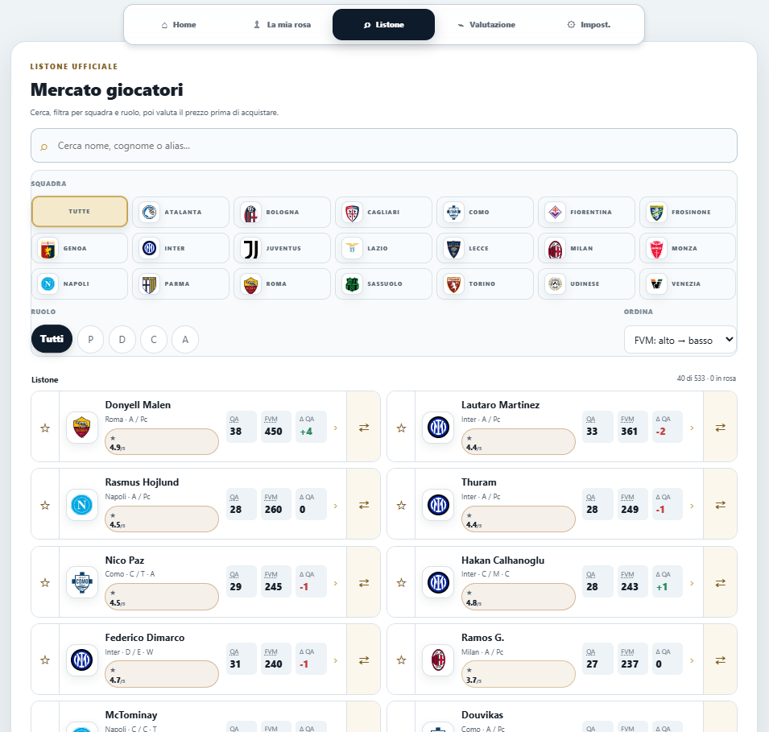
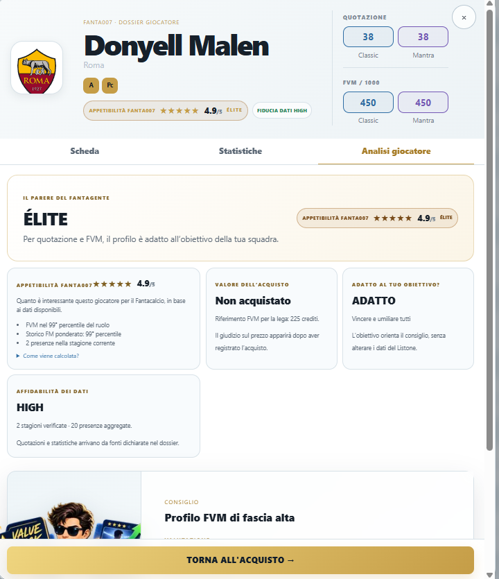
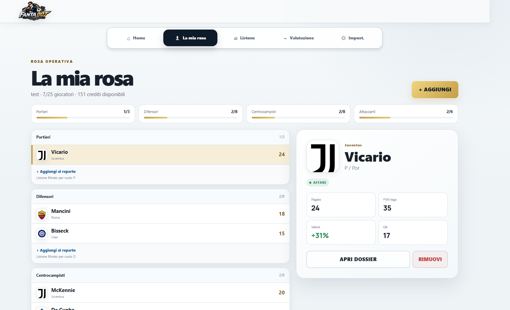
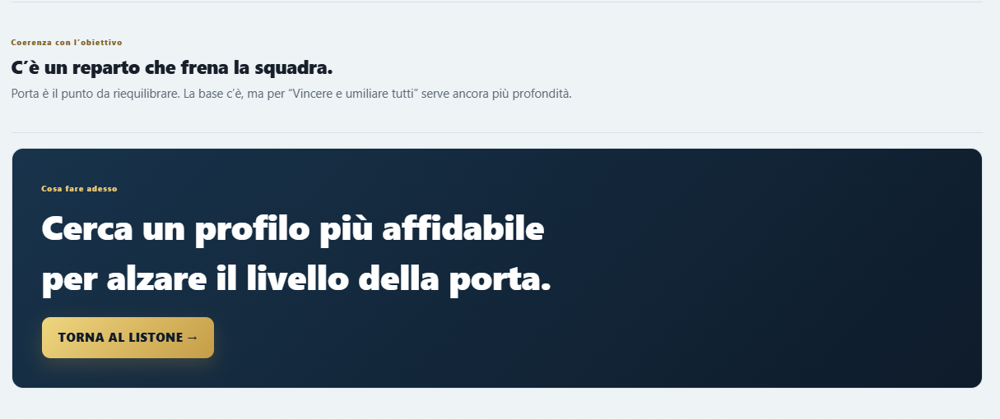
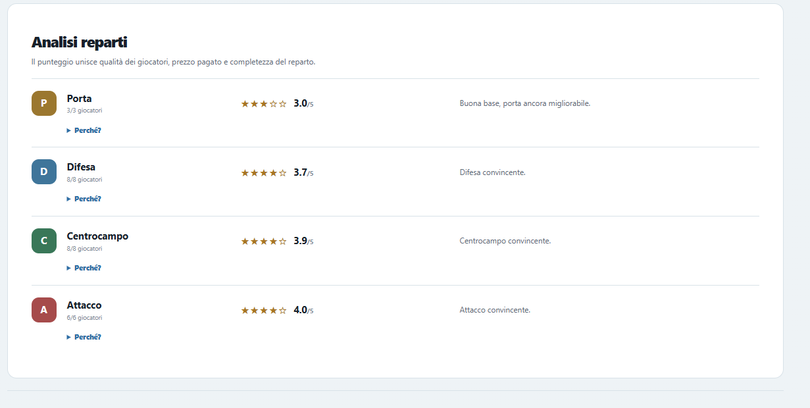
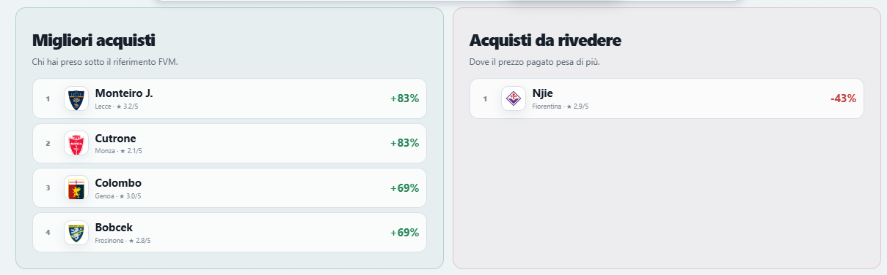
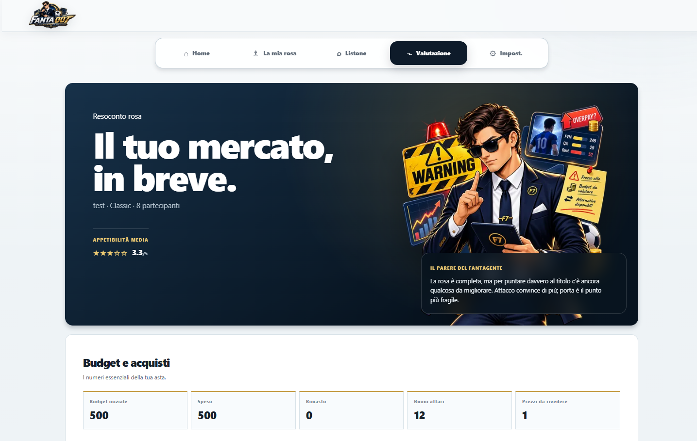

# Fanta007 — Licence to Win

**Fanta007** è una web app mobile-first e data-driven pensata per chi gioca al Fantacalcio e vuole leggere meglio listone, statistiche, valori e costruzione della propria rosa.

Non sostituisce una piattaforma di gestione lega: è uno **strumento di supporto alle decisioni** che combina dati verificati, scoring deterministico e una lettura semplice del mercato.

> 🎯 Obiettivo: trasformare tanti numeri sparsi in indicazioni più immediate, senza presentare stime o indicatori come verità assolute.



## Fanta007 in 30 secondi

1. Configura la tua lega e il budget.
2. Esplora il **Listone** e cerca i giocatori.
3. Apri il **Player Dossier** per statistiche e analisi.
4. Aggiungi gli acquisti a **La mia rosa** e inserisci il prezzo pagato.
5. Consulta **Valutazione** per capire punti forti, criticità e prossime mosse.

---

## 🏠 Home — prepara la tua missione

La Home è il punto di partenza. Riassume la situazione della rosa e adatta i riferimenti al contesto della lega configurata.

Puoi vedere rapidamente:

- giocatori acquistati e slot ancora liberi;
- crediti disponibili e investiti;
- avanzamento della rosa per reparto;
- suggerimenti contestuali del Fantagente 007.


---

## 🔎 Listone — esplora il mercato

Il Listone raccoglie i **533 giocatori** presenti nel dataset attivo della stagione 2026/27 e permette di cercare, filtrare e ordinare i profili.

Sono disponibili filtri per squadra e ruolo, ricerca testuale e ordinamenti basati su quotazioni e FantaValore di Mercato.



### Sigle principali

- **QI** — Quotazione iniziale
- **QA** — Quotazione attuale
- **FVM** — FantaValore di Mercato
- **PV** — Presenze a voto
- **MV** — Media voto
- **FM** — Fantamedia

Il FVM adattato alla lega è un **benchmark di riferimento**, non il “prezzo corretto” assoluto da pagare in asta.

---

## 🕵️ Player Dossier — conosci il giocatore

Ogni giocatore dispone di un dossier dedicato con tre aree principali: **Scheda**, **Statistiche** e **Analisi giocatore**.

Il dossier mette insieme:

- squadra, ruolo e quotazioni;
- FVM Classic e Mantra;
- statistiche stagionali e storiche disponibili;
- Appetibilità Fanta007;
- affidabilità dei dati;
- benchmark rispetto ai giocatori dello stesso ruolo;
- compatibilità con l'obiettivo della rosa;
- consiglio sintetico del Fantagente.



### Appetibilità ≠ prezzo d'acquisto

L'**Appetibilità Fanta007** misura quanto un profilo risulta interessante sulla base dei dati disponibili. È distinta dalla valutazione del prezzo realmente pagato: un ottimo giocatore può essere un cattivo affare se acquistato troppo caro, e viceversa.

---

## 👥 La mia rosa — costruisci la squadra

La rosa viene costruita manualmente inserendo i giocatori realmente acquistati durante l'asta.

Per ogni acquisto puoi registrare il prezzo pagato e confrontarlo con il riferimento FVM adattato al budget della tua lega.

La schermata mostra:

- composizione per reparto;
- prezzo pagato;
- FVM lega;
- Quotazione attuale (QA);
- classificazione dell'acquisto;
- crediti disponibili;
- accesso diretto al Dossier.



---

## 📊 Valutazione — guarda il mercato nel suo insieme

Quando la rosa prende forma, Fanta007 non si limita alla lista degli acquisti: costruisce un **resoconto complessivo del mercato**.

La pagina evidenzia:

- budget iniziale, speso e rimanente;
- numero di buoni affari;
- prezzi da rivedere;
- appetibilità media;
- giudizio sintetico del Fantagente.



### Analisi dei reparti

Porta, Difesa, Centrocampo e Attacco vengono valutati separatamente per rendere visibili eventuali squilibri nella costruzione della squadra.



### Migliori acquisti e acquisti da rivedere

Il prezzo pagato viene confrontato con il riferimento FVM per mettere in evidenza gli acquisti più convenienti e quelli su cui il costo pesa maggiormente.



### Cosa fare adesso

La valutazione termina con una **next action**: un'indicazione pratica sul reparto o sull'aspetto della rosa che merita maggiore attenzione.



---

## 🧠 Come funziona sotto il cofano

Fanta007 separa il **dato** dalla sua **interpretazione**.

Le statistiche vengono normalizzate nel dataset applicativo; indicatori come appetibilità, benchmark, convenienza dell'acquisto e valutazione dei reparti sono calcolati tramite logiche deterministiche e spiegabili.

```text
Dataset normalizzato
        ↓
FastAPI REST API
        ↓
React + TypeScript + Vite
        ↓
Scoring e benchmark deterministici
        ↓
Dossier, Rosa e Valutazione
```

Il Fantagente presenta e sintetizza i segnali prodotti dal sistema senza trasformare un indicatore in una certezza sul rendimento futuro.

---

## 📚 Dati e trasparenza

L'MVP utilizza il listone della stagione **2026/27**.

Dataset attivo:

- **533 giocatori**;
- **921 record stagionali** complessivi;
- 533 record Serie A 2026/27;
- 365 record Serie A 2025/26;
- 23 record EuroLeghe 2025/26 utilizzati come fallback verificato.

Per **145 giocatori** non è disponibile uno storico 2025/26 verificato nelle fonti utilizzate: in questi casi Fanta007 evita di inventare il dato.

I controlli di integrità finali sono documentati in [`docs/stats_integrity_final.md`](docs/stats_integrity_final.md).

---

## 🛠️ Stack tecnico

### Frontend
- React 19
- TypeScript
- Vite

### Backend
- Python
- FastAPI
- Pydantic

### Data pipeline
- import e normalizzazione da file strutturati;
- dataset JSON attivo;
- merge e validazione storica;
- audit automatici sui dati.

### Persistenza MVP
La configurazione della lega, la rosa e le preferenze principali vengono salvate nel browser tramite **localStorage/sessionStorage**. Non è richiesto un database per questa versione dell'MVP.

---

## 🚀 Avvio locale

### Backend

```powershell
python -m venv .venv
.\.venv\Scripts\python.exe -m pip install -e ".\backend[dev]"
.\.venv\Scripts\python.exe -m uvicorn app.main:app --app-dir .\backend --reload --port 8000
```

### Frontend

In un secondo terminale:

```powershell
npm install --prefix .\frontend
npm run dev --prefix .\frontend
```

Frontend locale: `http://localhost:5173`

API health: `http://127.0.0.1:8000/api/v1/health`

---

## ✅ Test

```powershell
.\.venv\Scripts\python.exe -m pytest .\backend\tests -q
npm test --prefix .\frontend
npm run build --prefix .\frontend
```

---

## 🌐 Demo online

**Deploy dell'MVP in preparazione.**

Una volta pubblicato, qui verrà inserito il link alla demo Vercel.

Percorso consigliato per provarlo:

**Home → Listone → Dossier → La mia rosa → Valutazione**

---

## 👨‍💻 Contesto del progetto

Fanta007 nasce come progetto portfolio durante il mio percorso **GenAI Specialist**.

Il progetto mi ha permesso di lavorare concretamente su:

- product design e definizione dell'MVP;
- UX/UI mobile-first;
- React e TypeScript;
- API REST con FastAPI;
- data normalization e data quality;
- scoring deterministico;
- integrazione frontend/backend;
- testing e preparazione al deploy.

---

## ⚠️ Nota

Fanta007 è un progetto indipendente a scopo didattico e portfolio. Nomi, marchi e dati di terze parti appartengono ai rispettivi titolari. Gli indicatori prodotti dall'app hanno finalità informative e non garantiscono risultati sportivi o di gioco.

---

**Fanta007 — Licence to Win**  
_Dati, contesto e decisioni: tutto nello stesso dossier._
