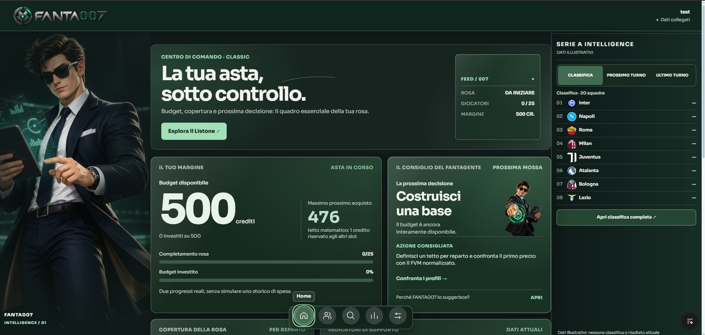
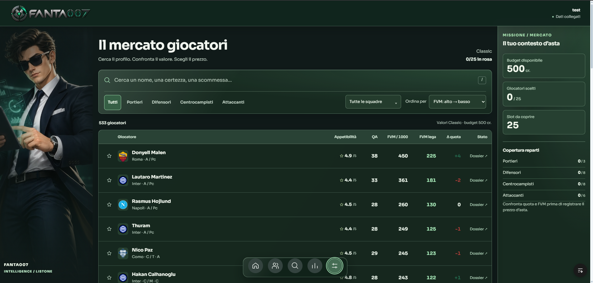
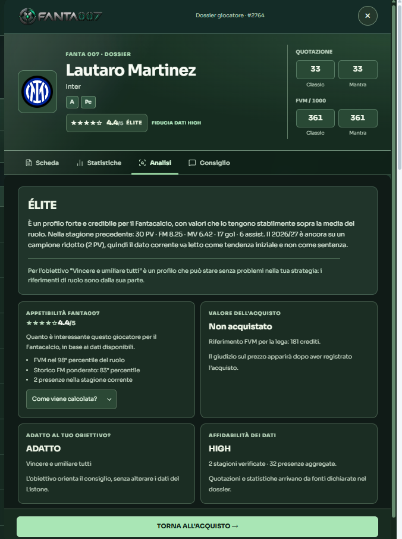
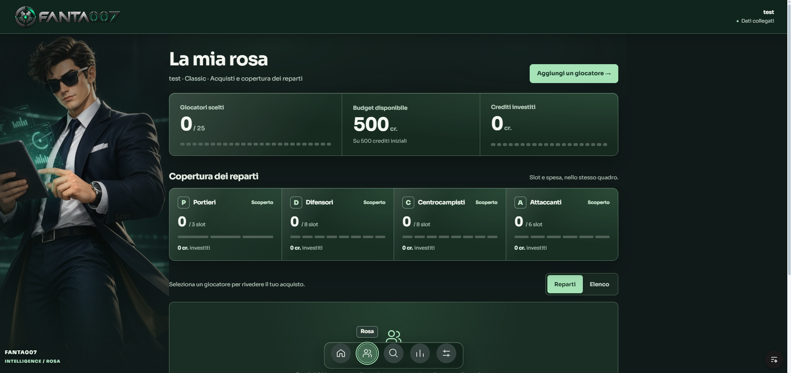

# FANTA007

**Il tuo agente personale per il fantacalcio.**

Prepara l’asta, costruisci la rosa e capisci dove intervenire: FANTA007 mette crediti, giocatori e dati utili nello stesso posto. Le indicazioni aiutano a decidere, non promettono risultati.

[Prova la demo](https://fanta007-licence-to-win.vercel.app/) · [Guarda il codice](https://github.com/AndreCalzone97/fanta007-licence-to-win)

## 🏠 La tua missione

La Home mostra subito budget, completamento della rosa e prossima decisione. Il Fantagente dà contesto alla scelta; la rail Serie A Intelligence raccoglie classifica e turni. Senza un provider live configurato, questi ultimi dati sono segnalati come illustrativi.

## 🔎 Cerca e valuta i giocatori

Nel Listone puoi cercare, filtrare e confrontare i profili. Aprendo un Dossier trovi quotazioni, statistiche e una spiegazione del consiglio: niente numeri inventati quando un dato non è disponibile.

Il Dossier raccoglie scheda, statistiche, analisi e consiglio in quattro viste. Qui è aperta l’analisi di Lautaro Martínez.

## 🧩 Costruisci la tua rosa

Registra ogni acquisto con il prezzo realmente pagato. La Rosa tiene insieme crediti rimasti, posti liberi e copertura di portieri, difensori, centrocampisti e attaccanti.

## 🧠 Capisci come sta andando

Valutazione riassume equilibrio dei reparti, segnali da seguire e prossima mossa suggerita. Se la rosa è ancora incompleta, il giudizio viene presentato come provvisorio.

## ⚙️ Come funziona

**Configura la lega → cerca i giocatori → registra gli acquisti → costruisci la rosa → analizzala.**

Non serve un account: configurazione e rosa restano nel browser in uso. Se cancelli i dati del browser o cambi dispositivo, non vengono trasferite automaticamente.

## 🛠️ Tech

React, TypeScript e Vite nel frontend; Python e FastAPI nel backend. Motion, Radix UI e Lucide supportano l’interfaccia. Test frontend e backend girano in [GitHub Actions](https://github.com/AndreCalzone97/fanta007-licence-to-win/actions); la demo è pubblicata su Vercel.

## 🚀 Stato progetto

**v0.5.0:** baseline UI/UX consolidata e pubblicata. Dati Serie A live, account sincronizzati, Fantagente conversazionale e funzioni da companion stagionale sono passi futuri, non feature già disponibili.

## 📚 Approfondimenti

[Prodotto](PRODUCT.md) · [Design](DESIGN.md) · [Architettura](docs/ARCHITECTURE.md) · [Roadmap](docs/ROADMAP.md)

FANTA007 è un progetto indipendente a scopo didattico e portfolio. Marchi e dati di terze parti appartengono ai rispettivi titolari.
